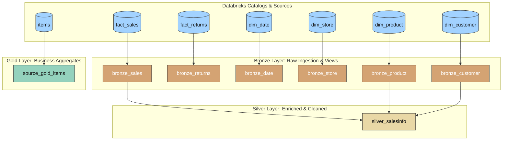

# 📊 dbt Begineers: Medallion Architecture on Databricks

Welcome to the **dbt Begineers** project! This repository contains a structured, end-to-end data transformation pipeline utilizing **dbt Core** and **dbt Databricks**. It demonstrates best practices in data engineering by implementing the **Medallion Architecture** (Bronze ➔ Silver ➔ Gold layers) using SQL-based modeling, custom testing, macros, and seed data.

---

## 🏗️ Architecture & Data Pipeline

This project processes source data through three distinct schemas representing different levels of data refinement and business logic:



### 1. 🥉 Bronze Layer (`models/bronze/`)
* **Purpose**: Acts as the landing area for raw data. It maps directly to source tables with minimal transformation.
* **Models**:
  * [bronze_sales.sql](file:///Users/muhammadabbas/Documents/DataEngineering/dbt-begineers/dbt_youtube/models/bronze/bronze_sales.sql) (Ingests sales fact data, configured as a view)
  * [bronze_store.sql](file:///Users/muhammadabbas/Documents/DataEngineering/dbt-begineers/dbt_youtube/models/bronze/bronze_store.sql)
  * [bronze_product.sql](file:///Users/muhammadabbas/Documents/DataEngineering/dbt-begineers/dbt_youtube/models/bronze/bronze_product.sql)
  * [bronze_customer.sql](file:///Users/muhammadabbas/Documents/DataEngineering/dbt-begineers/dbt_youtube/models/bronze/bronze_customer.sql)
  * [bronze_date.sql](file:///Users/muhammadabbas/Documents/DataEngineering/dbt-begineers/dbt_youtube/models/bronze/bronze_date.sql)
  * [bronze_returns.sql](file:///Users/muhammadabbas/Documents/DataEngineering/dbt-begineers/dbt_youtube/models/bronze/bronze_returns.sql)

### 2. 🥈 Silver Layer (`models/silver/`)
* **Purpose**: Cleans, joins, and enriches data from the Bronze layer.
* **Models**:
  * [silver_salesinfo.sql](file:///Users/muhammadabbas/Documents/DataEngineering/dbt-begineers/dbt_youtube/models/silver/silver_salesinfo.sql): Joins sales, products, and customer dimensions, calculates gross amount using a custom multiplication macro, and aggregates total sales by category and gender.

### 3. 🥇 Gold Layer (`models/gold/`)
* **Purpose**: Deduplicated, optimized, and business-facing datasets.
* **Models**:
  * [source_gold_items.sql](file:///Users/muhammadabbas/Documents/DataEngineering/dbt-begineers/dbt_youtube/models/gold/source_gold_items.sql): Applies window functions (`ROW_NUMBER`) to deduplicate incoming items by `id` based on the latest `updateDate`.

---

## 🛠️ Advanced dbt Implementations Included

### 🔌 Custom Schema Macro
By default, dbt appends custom schemas to the target schema (e.g., `dev_bronze`). This project overrides that behavior with [generate_schema.sql](file:///Users/muhammadabbas/Documents/DataEngineering/dbt-begineers/dbt_youtube/macros/generate_schema.sql), forcing models to build directly in clean schemas (`bronze`, `silver`, `gold`).

### 🧮 Custom Utility Macros
* **[multiply.sql](file:///Users/muhammadabbas/Documents/DataEngineering/dbt-begineers/dbt_youtube/macros/multiply.sql)**: A reusable macro representing standard SQL multiplication logic used to compute calculated metrics dynamically.

### 🧪 Robust Data Testing
* **Generic Schema Tests**: Out-of-the-box integrity validation (`unique` and `not_null` constraints) configured in [properties.yml](file:///Users/muhammadabbas/Documents/DataEngineering/dbt-begineers/dbt_youtube/models/bronze/properties.yml).
* **Accepted Values Test**: Confirms valid countries (e.g., `["USA", "Canada"]`) inside `bronze_store` with custom warning severity configurations.
* **Custom Generic Test**:
  * `generic_non_nagative` (defined in [generic_non_negative.sql](file:///Users/muhammadabbas/Documents/DataEngineering/dbt-begineers/dbt_youtube/tests/generic/generic_non_negative.sql)): Validates that values in specified columns (e.g., `gross_amount`) are non-negative.
* **Singular Test**:
  * [non_negative_test.sql](file:///Users/muhammadabbas/Documents/DataEngineering/dbt-begineers/dbt_youtube/tests/non_negative_test.sql): Custom SQL validation verifying that `gross_amount` and `net_amount` are never simultaneously negative in the sales dataset.

---

## 🚀 Getting Started

### 1. Prerequisites
Ensure you have the following installed:
* **Python** (version `>=3.12`)
* **uv** (Recommended python package manager) or `pip`

### 2. Environment Setup
Clone this repository, then set up your virtual environment and install the required dependencies:

```bash
# Create and activate virtual environment
uv venv
source .venv/bin/activate

# Install dependencies
uv pip install -r requirements.txt
```

### 3. Connection Configuration
Configure your Databricks credentials in your local `~/.dbt/profiles.yml` file:

```yaml
dbt_youtube:
  outputs:
    dev:
      type: databricks
      schema: main         # Your target default schema/database
      catalog: hive_metastore # Replace with your Databricks catalog name
      host: <your-databricks-host-url>
      http_path: <your-sql-warehouse-http-path>
      token: <your-personal-access-token>
      threads: 4
  target: dev
```

---

## 🏃 Commands Reference

Navigate to the [dbt_youtube](file:///Users/muhammadabbas/Documents/DataEngineering/dbt-begineers/dbt_youtube) directory to run the following dbt commands:

| Command | Action |
|:---|:---|
| `dbt debug` | Test connection and configuration profile |
| `dbt seed` | Load static seed data (e.g., [lookup.csv](file:///Users/muhammadabbas/Documents/DataEngineering/dbt-begineers/dbt_youtube/seeds/lookup.csv)) |
| `dbt run` | Execute and build all models in order |
| `dbt test` | Execute generic and singular tests |
| `dbt clean` | Delete generated targets and packages |
| `dbt docs generate` | Generate project documentation website |
| `dbt docs serve` | Launch local web server for interactive docs |

---

## 📂 Project Structure

```text
dbt-begineers/
├── dbt_youtube/                 # Main dbt project folder
│   ├── analyses/
│   ├── macros/                  # Custom SQL & Jinja templates
│   │   ├── generate_schema.sql  # Schema overrides
│   │   └── multiply.sql         # Custom math utilities
│   ├── models/                  # Medallion layers and SQL logic
│   │   ├── bronze/              # Raw data views & schema tests
│   │   ├── silver/              # Business logic & aggregates
│   │   ├── gold/                # Final output & deduplicated data
│   │   └── source/              # Source declarations (sources.yml)
│   ├── seeds/                   # CSV lookups/seeds
│   ├── snapshots/               # SCD logic (Slowly Changing Dimensions)
│   ├── tests/                   # Singular and generic tests
│   ├── dbt_project.yml          # Core dbt configuration file
│   └── README.md                # Inner README file
├── pyproject.toml               # Python metadata & package dependencies
├── requirements.txt             # Locked dependencies list
└── main.py                      # Simple boilerplate verification script
```
